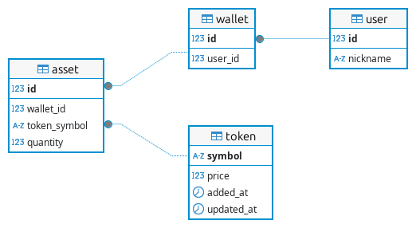

# CoinCap Code Challenge


## Table Of Contents

1. [Introduction](#introduction)
2. [Prerequisites](#prerequisites)
3. [Development](#development)
   1. [Technologies](#technologies)
   2. [Entity Relationship Diagram](#entity-relationship-diagram)
   3. [Installation](#installation)
4. [Usage](#usage)
5. [License](#license)

## Introduction

**CoinCap Code Challenge** is a project developed to address a coding challenge
that requires the use of [Java 17](https://javaalmanac.io/jdk/17/),
[Spring Boot 3](https://spring.io/projects/spring-boot), an [SQL](https://en.wikipedia.org/wiki/SQL) database,
and data sourced from [CoinCap API](https://docs.coincap.io/).

## Prerequisites

- [Java 17](https://javaalmanac.io/jdk/17/)
- [MySQL](https://www.mysql.com/)

## Development

### Technologies

**CoinCap Code Challenge** is a [Spring Boot](https://spring.io/projects/spring-boot)
application and uses a [MySQL](https://www.mysql.com/) database.

### Entity Relationship Diagram

The following image shows the Entity Relationship Diagram for the **CoinCap Code Challenge** application.



### Installation

#### Clone the repository

Make sure that you have the prerequisites installed on your development machine and then clone this repository with the following command:

```sh
git clone git@github.com:EnduranceCode/coincap-challenge.git
```
#### Set up the database

##### Create a MySQL database

Login into the [MySQL](https://www.mysql.com/) server, replace the ***{LABEL}*** in the below command as appropriate
and then execute it to [create](https://www.mysqltutorial.org/mysql-create-database/) the **CoinCap Code Challenge**
database.

```sh
CREATE DATABASE {DATABASE_NAME} CHARACTER SET utf8mb4 COLLATE utf8mb4_0900_ai_ci;
```
> **Label Definition**
>
> + **{DATABASE_NAME}** : The name chosen for the new database;

##### Create a MySQL user

To [create a user](https://www.mysqltutorial.org/mysql-create-user.aspx) for the **CoinCap Code Challenge** database
management, replace the ***{LABELS}*** in the below command as appropriate and then execute it.

```sh
CREATE USER '{USERNAME}'@'localhost' IDENTIFIED WITH caching_sha2_password BY '{PASSWORD}';
```

> **Labels Definition**
>
> + **{USERNAME}** : The new account name in the MySQL Server;
> + **{PASSWORD}** : The password of the new account in the MySQL Server.

##### Grant privileges to the CoinCap Code Challenge MySQL user

To [grant the necessary privileges](https://www.mysqltutorial.org/mysql-grant.aspx) to the **CoinCap Code Challenge**
database user, replace the ***{LABELS}*** in the below command as appropriate and then execute it.

```sh
GRANT ALL PRIVILEGES ON {DATABASE_NAME}.* TO '{USERNAME}'@'localhost';
```

> **Labels Definition**
>
> + **{DATABASE_NAME}** : The database where the MySQL user will be granted privileges;
> + **{USERNAME}** : The account name in the MySQL Server to whom the privileges will be assigned.

##### Configure the application's database access

To configure the **CoinCap Code Challenge**  access to the database, take the following
steps:

1. Copy the file [`application-secure-TEMPLATE.yml`](./src/main/resources/application-secure-TEMPLATE.yml),
   located in the `resources` folder and rename it to `application-secure.yaml`;
2. Replace the {DATABASE_NAME} placeholder with the **CoinCap Code Challenge** database name;
3. Replace the {DATABASE_USER} placeholder with the **CoinCap Code Challenge** database user's username;
4. Replace the {DATABASE_NAME} placeholder with the **CoinCap Code Challenge**database user's password;
5. Delete the comments block, at the top of the file, that contains these instructions;
6. Add the comment 'DO NOT COMMIT THIS FILE!' to the first line of the file.

##### Manage the application's database migrations

The file [`DATABASE.md`](./src/main/resources/db/DATABASE.md), stored in the folder
[`src/main/resources/db/`](./src/main/resources/db), documents the process to manage the **CoinCap Code Challenge**
database migrations.

## Usage

To run the **CoinCap Code Challenge** application, execute the following command:

```sh
./mvnw spring-boot:run
```

The application will start and be accessible at the following URL:

```sh
localhost:8083
```

## License

**CoinCap Code Challenge** is licensed under the terms of [MIT License](./LICENSE).
